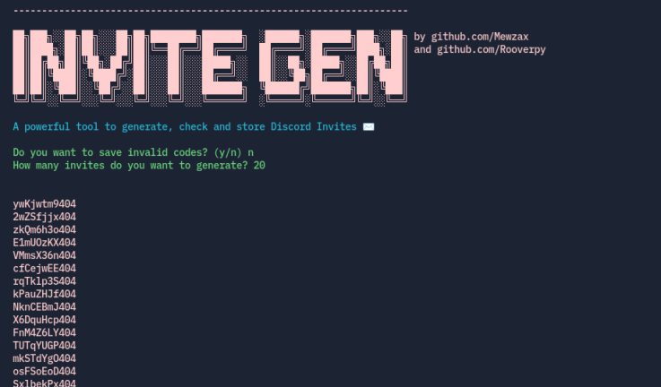

<h1 align="center">Discord-Invite-Generator</h1>
<p align="center">

</p>

<h4 align='center'>✉️ A simple tool to create, check then store discord invites</h4>

## Preview


## Features

- Generate a lot of discord invites
- Checks Invite at the same time for maximum efficiency
- Store the invites
- Proxies support

## To do:

- [ ] Add a joiner (u'll probably get a ban lol)

## Built with

- [httpx](https://www.python-httpx.org)
- [colorama](https://pypi.org/project/colorama/)

## Requirements

- [Python](https://www.python.org/downloads/)
- Proxies (optional)

## Installation

```py
# Clone the repo:
git clone https://github.com/Mewzax/Discord-Invite-Generator.git
cd Discord-Invite-Generator

# Install packages
pip install -r requirements.txt

# Run the code
python3 main.py
```

<p align="center"> 
    <b>Informations</b><br>
    
    
    
</p>
